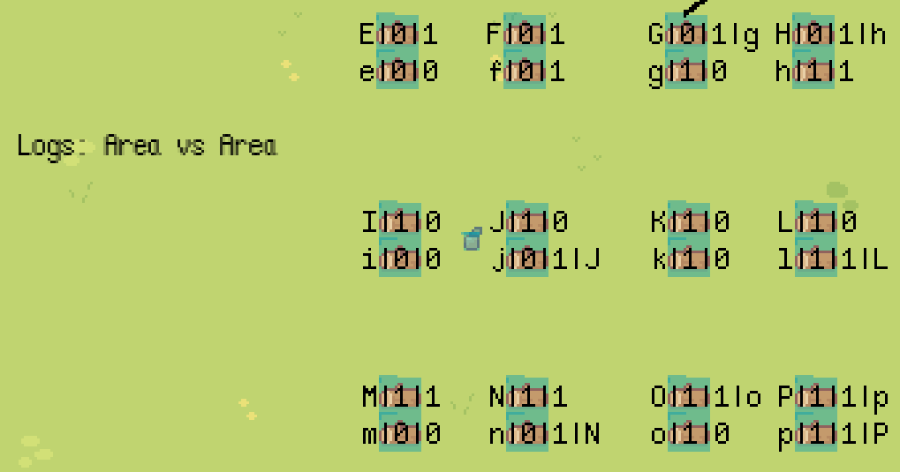

# Godot Collision Test

Tests collisions and area detections with `StaticBody2D`, `RigidBody2D`, and `Area2D`.

## Collision Layer vs Collision Mask

The [Godot documentation][1] states: the **collision_layer** describes the layers that the object appears in. By default, all bodies are on layer `1`. The **collision_mask** describes what **layers** the body will scan for collisions. If an object is not in one of the mask layers, the body will ignore it. By default, all bodies scan layer `1`.

## Skulls, Bushes, and Logs

The numbers above the sprites are the sprite's `collision_layer` and `collision_mask` values. For example, a sprite with `collision_layer` set to `1` and `collision_mask` set to `0` will have text `1|0` displayed.


## Logs: Area2D vs Area2D

In the "Logs: Area vs Area" section, the logs are just slightly overlapped in order to trigger the `_on_area_entered` signal if applicable. The logs have a more detailed `label` with format: 

```
name|collision_layer|collision_mask|body/area entered
```

For example in the screenshot below, log `G` has label `G|0|1|g` because it overlaps with log `g` (note the capitalization). Log `G` with a mask of `1` scans for all objects on layer `1` and, therefore, detects log `g`. Note that log `g` with mask `0` does not scan for any layer and, therefore, does not detect any overlap.



[1]:https://docs.godotengine.org/en/stable/tutorials/physics/physics_introduction.html#collision-layers-and-masks