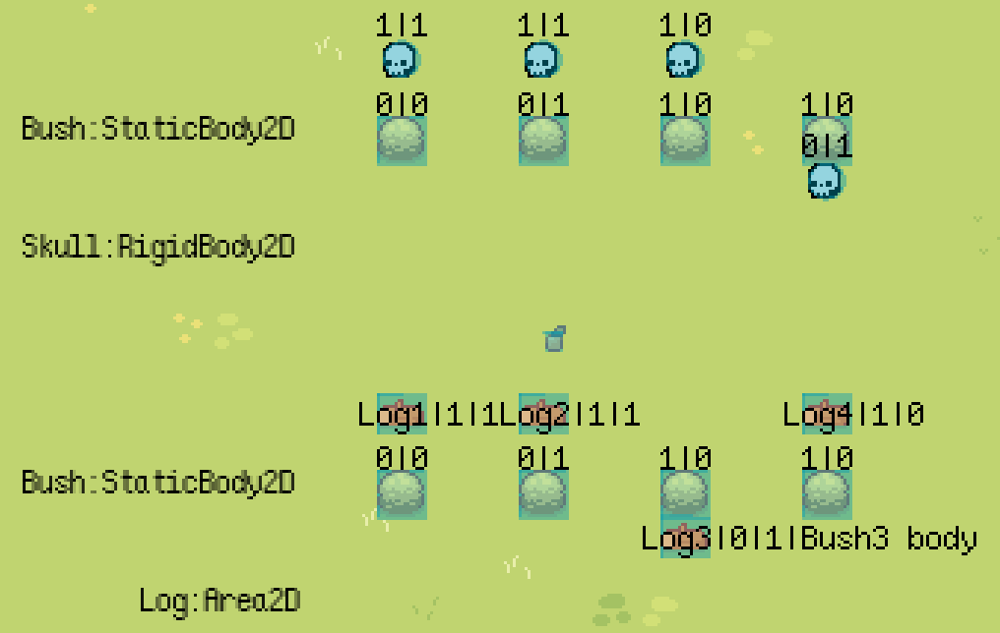

# Godot Collision Test

Tests collisions and area detections with `StaticBody2D`, `RigidBody2D`, and `Area2D`.

The numbers above the sprites are the sprite's `collision_layer` and `collision_mask` values. For example, a sprite with `collision_layer` set to `1` and `collision_mask` set to `0` will have text `1|0` displayed.

## Screenshot

